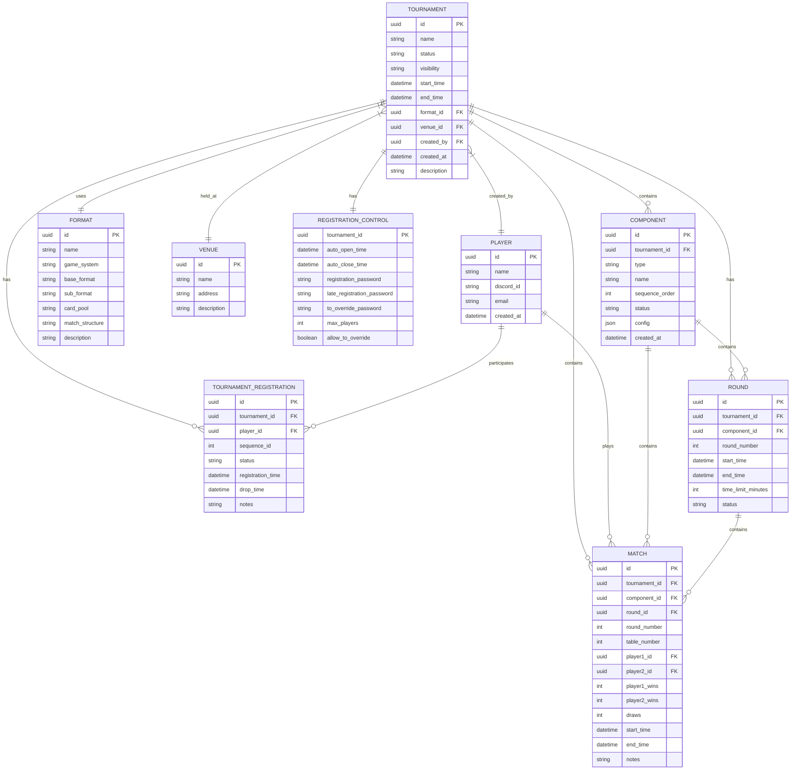

# Tournament Director Data Model

*AIA PAI Hin R Claude Code v1.0 // AIA Primarily AI, Human-initiated, Reviewed, Claude Code v1.0 // This work was primarily AI-generated. AI was prompted for its contributions, or AI assistance was enabled. AI-generated content was reviewed and approved. The following model(s) or application(s) were used: Claude Code.*

## Overview

Tournament Director supports multiple Trading Card Games with flexible tournament structures. The data model is built around atomic objects and their relationships, designed for extensibility and future API integration.

## Supported Game Systems

```python
class GameSystem(str, Enum):
    MTG = "magic_the_gathering"
    POKEMON = "pokemon"
    STAR_WARS_UNLIMITED = "star_wars_unlimited"
    NFL_FIVE = "nfl_five"
    CUSTOM = "custom_tcg"
```

## Format Classification

### Base Format Categories
```python
class BaseFormat(str, Enum):
    CONSTRUCTED = "constructed"        # Build your own deck from card pool
    PRE_CONSTRUCTED = "pre_constructed" # Use provided/official decks
    LIMITED = "limited"               # Draft/Sealed from packs
    SPECIAL = "special"               # JumpStart, Cube, house rules
```

### Format Examples by Category

**CONSTRUCTED** (Build your own deck):
- MTG: **Pauper** (priority!), Standard, Modern, Legacy, Vintage
- Pokemon: Standard, Expanded, Unlimited
- Star Wars: Standard
- NFL Five: Standard

**PRE_CONSTRUCTED** (Use provided decks):
- MTG: Challenger Decks, World Championship Decks
- Pokemon: Theme Decks, Battle Academy
- Any starter/precon products

**LIMITED** (Draft/Sealed):
- MTG: Traditional Draft, Sealed, Dark Draft, Winston Draft, Solomon Draft
- Pokemon: Draft, Sealed
- Any pack-based formats

**SPECIAL** (Everything else):
- MTG: JumpStart, Cube Draft
- House rules variants
- Custom formats that don't fit other categories

## Atomic Objects (No Dependencies)

### Player
```python
class Player(BaseModel):
    id: UUID
    name: str
    discord_id: Optional[str] = None
    email: Optional[str] = None
    created_at: datetime
```

### Format
```python
class Format(BaseModel):
    id: UUID
    name: str
    game_system: GameSystem
    base_format: BaseFormat
    sub_format: Optional[str] = None      # "Traditional Draft", "Winston", etc.
    card_pool: str                        # "Standard", "Modern", "Pauper"
    match_structure: Optional[str] = None # "BO1", "BO3", etc.
    description: Optional[str] = None
```

### Venue
```python
class Venue(BaseModel):
    id: UUID
    name: str  # "Kitchen Table", "Snack House", "Local Game Store", "Discord Server"
    address: Optional[str] = None
    description: Optional[str] = None
```

## Tournament Structure

### Registration Control
```python
class RegistrationControl(BaseModel):
    auto_open_time: Optional[datetime] = None
    auto_close_time: Optional[datetime] = None
    registration_password: Optional[str] = None      # Required during normal registration
    late_registration_password: Optional[str] = None # Allows registration after close
    allow_to_override: bool = True
    to_override_password: Optional[str] = None       # TO can override anything
    max_players: Optional[int] = None
```

### Tournament Status & Visibility
```python
class TournamentStatus(str, Enum):
    DRAFT = "draft"                    # Being set up
    REGISTRATION_OPEN = "registration_open"   # Players can register
    REGISTRATION_CLOSED = "registration_closed"  # No new players
    IN_PROGRESS = "in_progress"        # Tournament running
    COMPLETED = "completed"            # Finished
    CANCELLED = "cancelled"            # Terminated early

class TournamentVisibility(str, Enum):
    PUBLIC = "public"                  # Visible to all, may require password
    PRIVATE = "private"                # Invitation only
```

### Tournament
```python
class Tournament(BaseModel):
    id: UUID
    name: str
    status: TournamentStatus = TournamentStatus.DRAFT
    visibility: TournamentVisibility = TournamentVisibility.PUBLIC
    registration: RegistrationControl
    start_time: Optional[datetime] = None
    end_time: Optional[datetime] = None
    format_id: UUID
    venue_id: UUID
    created_by: UUID  # Player ID of tournament organizer
    created_at: datetime
    description: Optional[str] = None
```

## Relationship Objects

### Tournament Registration
```python
class PlayerStatus(str, Enum):
    ACTIVE = "active"
    DROPPED = "dropped" 
    LATE_ENTRY = "late_entry"

class TournamentRegistration(BaseModel):
    id: UUID
    tournament_id: UUID
    player_id: UUID
    sequence_id: int  # Per-tournament player number (#1, #2, #3...)
    status: PlayerStatus = PlayerStatus.ACTIVE
    registration_time: datetime
    drop_time: Optional[datetime] = None
    notes: Optional[str] = None
```

### Tournament Components
```python
class ComponentType(str, Enum):
    SWISS = "swiss"
    SINGLE_ELIMINATION = "single_elimination"
    ROUND_ROBIN = "round_robin"
    POOL_PLAY = "pool_play"

class ComponentStatus(str, Enum):
    PENDING = "pending"
    ACTIVE = "active"
    COMPLETED = "completed"

class Component(BaseModel):
    id: UUID
    tournament_id: UUID
    type: ComponentType
    name: str  # "Swiss Rounds", "Top 8", "Pool A"
    sequence_order: int  # Order within tournament (1, 2, 3...)
    status: ComponentStatus = ComponentStatus.PENDING
    config: dict  # Component-specific configuration
    created_at: datetime
```

### Rounds and Matches
```python
class RoundStatus(str, Enum):
    PENDING = "pending"
    ACTIVE = "active"
    COMPLETED = "completed"

class Round(BaseModel):
    id: UUID
    tournament_id: UUID  
    component_id: UUID
    round_number: int
    start_time: Optional[datetime] = None
    end_time: Optional[datetime] = None
    time_limit_minutes: Optional[int] = None
    status: RoundStatus = RoundStatus.PENDING

class Match(BaseModel):
    id: UUID
    tournament_id: UUID
    component_id: UUID
    round_id: UUID
    round_number: int
    table_number: Optional[int] = None
    player1_id: UUID
    player2_id: Optional[UUID] = None  # None for bye
    player1_wins: int = 0
    player2_wins: int = 0
    draws: int = 0
    start_time: Optional[datetime] = None
    end_time: Optional[datetime] = None
    notes: Optional[str] = None
```

## Computed/Derived Data (Not Stored)

### Standings (Calculated Dynamically)
Tournament standings are computed from match results rather than stored:
```python
# Computed standings include:
- rank: int                              # Current tournament position
- match_points: int                      # 3 for win, 1 for draw, 0 for loss  
- game_wins/losses/draws: int           # Individual game statistics
- matches_played: int                    # Total matches completed
- match_win_percentage: float           # MW% for tiebreaker
- game_win_percentage: float            # GW% for tiebreaker
- opponent_match_win_percentage: float  # OMW% for Swiss tiebreaker
- opponent_game_win_percentage: float   # OGW% for Swiss tiebreaker
- bye_count: int                        # Number of byes received
```

### Future Extensions (Planned)
```python
class TournamentSeries(BaseModel):      # Multi-tournament series
class DeckList(BaseModel):              # Player deck submissions  
class Penalty(BaseModel):               # Judge penalties/warnings
class Timer(BaseModel):                 # Round and match timing
```

## Entity Relationship Diagram



## Tournament Flow Architecture


## Key Design Decisions

### 1. Multi-Game System Support
- **Extensible**: Easy to add new TCGs
- **Format Flexibility**: Four-tier classification handles all game types
- **Game-Specific Logic**: Validation and rules per game system

### 2. UUID + Sequence ID Pattern
- **UUID**: Global unique identifier for database integrity and API safety
- **Sequence ID**: Human-readable tournament-scoped numbering (#1, #2, #3...)
- **Best of Both**: Technical robustness + human usability

### 3. Component-Based Tournament Structure  
- **Flexible**: Swiss → Elimination, Pool Play → KO, Round Robin only
- **Modular**: Each component manages its own rounds and matches
- **Extensible**: New component types can be added without schema changes

### 4. Three-Tier Registration Control
- **Time-based**: Auto-open/close registration with dates
- **Password-protected**: Multiple password tiers (normal, late, TO override)
- **Visibility Control**: Public vs private tournaments
- **TO Override**: Emergency manual control with separate authentication

### 5. Player State Management
- **Global Players**: Exist across all tournaments with persistent identity
- **Tournament Registration**: Per-tournament participation with sequence IDs
- **Status Tracking**: Active, dropped, late entry with full audit trail
- **Flexible Operations**: Drop, undrop, late entry with bye loss handling

### 6. Match-Centric Data Model
- **Atomic Results**: All statistics derived from match results
- **Immutable History**: Matches are historical facts
- **Flexible Scoring**: Supports wins/losses/draws, bye handling
- **Audit Trail**: Full match history with timestamps and notes

## Database Constraints

```sql
-- Unique sequence IDs per tournament
UNIQUE(tournament_id, sequence_id) ON tournament_registration

-- No duplicate registrations  
UNIQUE(tournament_id, player_id) ON tournament_registration

-- Component ordering within tournaments
UNIQUE(tournament_id, sequence_order) ON component

-- Round numbering per component
UNIQUE(component_id, round_number) ON round

-- Table assignment per round (if specified)
UNIQUE(tournament_id, round_number, table_number) ON match WHERE table_number IS NOT NULL

-- Format names unique per game system
UNIQUE(game_system, name) ON format
```

## Future Extensions

### Planned Additions
- **DeckList**: Player deck submissions with format validation
- **TournamentSeries**: Cross-tournament aggregation and scoring
- **Penalty**: Judge warnings, game losses, match losses
- **Timer**: Round timers, match clocks, tournament scheduling
- **Export**: Tournament reports, standings export, bracket generation

### Integration Points
- **Discord Bot**: Tournament management via Discord commands
- **Web Interface**: Browser-based tournament management
- **External APIs**: Card validation (Scryfall, Pokemon, etc.)
- **Streaming**: Integration with tournament broadcasting tools

## Backend Architecture

The data model supports three backend implementations:
- **Mock Backend**: In-memory objects for testing and development
- **Local Backend**: File-based storage (JSON/SQLite) for standalone use
- **Database Backend**: PostgreSQL/MySQL with full ACID compliance for production

All backends implement the same data layer interface, allowing seamless transitions from local development to production deployment. The API server can use any backend via configuration.
